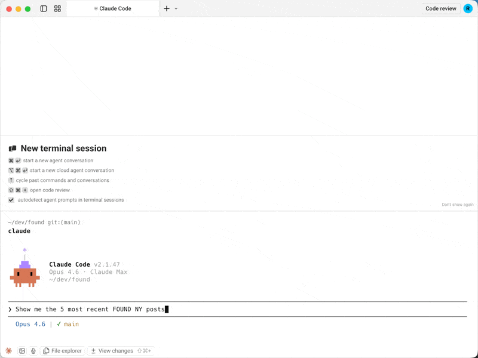

# substack-publisher-mcp

**MCP server for Substack's official Publisher API**

[](LICENSE)
[](https://nodejs.org)
[](https://modelcontextprotocol.io)

> **Note:** This is an unofficial, community-developed tool and is not affiliated with, endorsed by, or supported by Substack, Inc.

The first MCP server for Substack's official [Publisher API](https://publisher-api.substack.com/v1/docs/). Query post analytics, subscriber counts, and publication data directly from Claude, Cursor, or any MCP client.



## Why this server?

| | substack-publisher-mcp | Other Substack MCP servers |
|---|---|---|
| **API** | Official Publisher API | Unofficial internal API |
| **Auth** | API key (stable) | Browser cookies (fragile) |
| **Stability** | Official, documented API | Breaks when Substack changes internals |
| **Multi-publication** | Built-in support | Not available |

## Prerequisites

- **Node.js 18+**
- **Substack Publisher API key** — Available from the [Publisher API docs](https://publisher-api.substack.com/v1/docs/)

## Quick Start

### 1. Install

```bash
git clone https://github.com/dkships/substack-publisher-mcp.git
cd substack-publisher-mcp
npm install && npm run build
```

### 2. Configure your MCP client

Add to your client's MCP config file:

| Client | Config file |
|--------|-------------|
| Claude Desktop (macOS) | `~/Library/Application Support/Claude/claude_desktop_config.json` |
| Claude Desktop (Windows) | `%APPDATA%\Claude\claude_desktop_config.json` |
| Claude Code | `.mcp.json` in your project directory |
| Cursor | `.cursor/mcp.json` |

```json
{
  "mcpServers": {
    "substack": {
      "command": "node",
      "args": ["/path/to/substack-publisher-mcp/dist/index.js"],
      "env": {
        "SUBSTACK_API_KEY": "your-api-key-here"
      }
    }
  }
}
```

> **Claude Code users:** Add `"type": "stdio"` to the server config.

### 3. Start using it

Ask Claude: *"Show me my recent posts"* or *"What are my subscriber counts for the last 30 days?"*

## Tools

| Tool | Description | Key Parameters |
|------|-------------|----------------|
| `list_publications` | List configured publications | None |
| `list_posts` | List published posts | `startDate`, `endDate`, `sortBy`, `type`, `maxResults`, `next` |
| `get_post` | Get a specific post by URL slug | `urlSlug` (required) |
| `get_post_stats` | Get engagement stats for a post | `urlSlug` (required) |
| `get_subscriber_counts` | Get daily subscriber counts by type | `startDate`, `endDate` |
| `get_subscriber` | Look up a subscriber by email | `email` (required) |

All tools accept an optional `publication` parameter when multiple publications are configured.

### Example responses

<details>
<summary><code>get_subscriber_counts</code></summary>

```json
[
  {
    "date": "2025-01-15",
    "total_email_subscribers": 25000,
    "paid_subscribers": 500,
    "free_trial_subscribers": 10,
    "comp_subscribers": 50,
    "gift_subscribers": 15,
    "lifetime_subscribers": 0,
    "founding_subscribers": 25
  }
]
```
</details>

<details>
<summary><code>get_post_stats</code></summary>

```json
{
  "clicks": 320,
  "opens": 5400,
  "post_id": 12345678,
  "recipients": 10000,
  "views": 6100,
  "new_free_subscriptions": 80,
  "new_paid_subscriptions": 5,
  "estimated_revenue_increase": 400
}
```
</details>

<details>
<summary><code>list_posts</code></summary>

```json
{
  "posts": [
    {
      "title": "My Latest Post",
      "audience": "only_paid",
      "subtitle": "A deep dive into the topic",
      "postDate": "2025-01-15T12:00:00.000Z",
      "urlSlug": "my-latest-post",
      "coverImage": "https://substackcdn.com/image/..."
    }
  ],
  "next": "abc123cursor"
}
```
</details>

## Multiple publications

If you manage multiple Substack publications, configure a separate API key for each using the `SUBSTACK_API_KEY_<NAME>` pattern:

```json
{
  "mcpServers": {
    "substack": {
      "command": "node",
      "args": ["/path/to/substack-publisher-mcp/dist/index.js"],
      "env": {
        "SUBSTACK_API_KEY_MAIN": "your-main-blog-key",
        "SUBSTACK_API_KEY_TECH": "your-tech-newsletter-key",
        "SUBSTACK_API_KEY_COMPANY": "your-company-updates-key"
      }
    }
  }
}
```

Then specify which publication to query:

> *"Show me subscriber counts for main"*
> *"List recent posts from the tech publication"*

Use `list_publications` to see all configured publication names.

## Troubleshooting

| Issue | Solution |
|-------|----------|
| `Unauthorized` error | Verify your API key is correct. The key goes directly in the `authorization` header with no `Bearer` prefix. |
| `Missing environment variables` warning | Only configure env vars for publications you have keys for. Remove the rest. |
| Server won't start | Make sure you ran `npm run build` after cloning. The server runs from `dist/`, not `src/`. |
| `No API keys configured` | Set `SUBSTACK_API_KEY` or `SUBSTACK_API_KEY_<NAME>` in your MCP client config. |

## API Reference

This server wraps the [Substack Publisher API](https://publisher-api.substack.com/v1/docs/). See Substack's documentation for details on available data and rate limits.

## Contributing

See [CONTRIBUTING.md](CONTRIBUTING.md) for guidelines.

## License

MIT License. See [LICENSE](LICENSE) for details.

---

Substack is a trademark of Substack, Inc. This project is not affiliated with Substack, Inc. Use of the Substack name is for descriptive purposes only.
